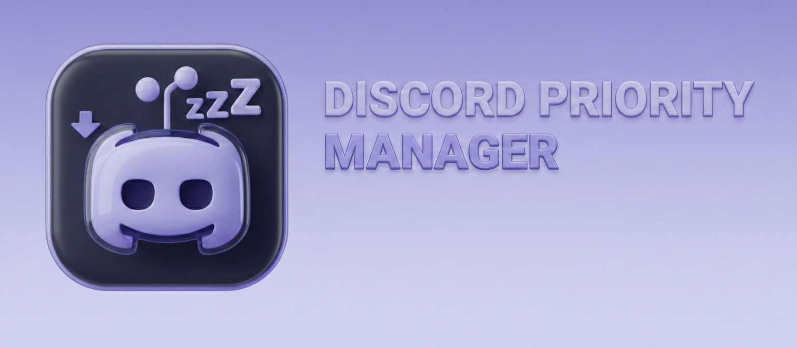

# Discord Priority Manager Pro

<div align="center">



<h4>Made by <a href="https://github.com/AT0KI">ATOKI</a></h4>

[](https://github.com/AT0KI/discord-priority-manager/releases)
[](LICENSE)
[](https://github.com/AT0KI/discord-priority-manager/releases)
[](https://www.python.org/)

**Автоматическое управление приоритетом Discord во время игр**

[English](#english) | [Українська](#українська) | [Русский](#русский)

</div>

---

## 🎮 О проекте

Discord Priority Manager Pro — профессиональное приложение для Windows, которое автоматически управляет приоритетом процессов Discord во время игровых сессий. Программа помогает максимизировать игровую производительность, снижая приоритет Discord когда вы играете.

### ✨ Ключевые возможности

- 🎯 **Интеллектуальное управление приоритетом** — автоматическое определение игр и динамическая регулировка
- 🎮 **Богатая база игр** — 14 популярных игр с возможностью добавления своих
- 🌍 **Полная мультиязычность** — интерфейс на русском, украинском и английском
- 🔄 **Автозапуск с Windows** — бесшовная интеграция в систему
- 📊 **Детальный мониторинг** — отслеживание процессов, CPU и памяти в реальном времени
- 💾 **Гибкая конфигурация** — 3 уровня приоритета и настраиваемые интервалы
- 🎨 **Современный Discord-style UI** — элегантный темный интерфейс
- 🔔 **System Tray интеграция** — работа в фоне с цветными иконками
- 📝 **Умное логирование** — ротация логов с автоочисткой

---

## 🚀 Быстрый старт

### Вариант 1: Готовый EXE

1. Перейдите на [Releases](https://github.com/AT0KI/discord-priority-manager/releases)
2. Скачайте `DiscordPriorityManager.exe`
3. Запустите программу
4. Готово!

### Вариант 2: Из исходников

```bash
git clone https://github.com/AT0KI/discord-priority-manager.git
cd discord-priority-manager
pip install -r requirements.txt
python discord_priority_manager_FIXED.py
```

---

## 📖 Использование

### Первый запуск

1. **Запустите** программу
2. **Выберите язык** (RU/UK/EN)
3. **Настройте приоритеты**:
   - Игровой режим: `IDLE` (рекомендуется)
   - Обычный режим: `BELOW_NORMAL` (рекомендуется)
4. **Нажмите "▶ Старт"**

### Уровни приоритета

Программа поддерживает **3 уровня**:

| Уровень | Описание | Когда использовать |
|---------|----------|-------------------|
| **IDLE** | Минимальный приоритет | ✅ Для игр (устраняет лаги) |
| **BELOW_NORMAL** | Ниже нормального | ✅ Для обычного режима |
| **NORMAL** | Нормальный приоритет | Если нужна полная производительность Discord |

### Интервалы проверки

- **Обычный режим**: 0.5-60 сек (по умолчанию 2 сек)
- **Игровой режим**: 0.5-60 сек (по умолчанию 1 сек)

### System Tray

- 🟢 **Зелёная иконка** — мониторинг активен
- 🔴 **Красная иконка** — мониторинг остановлен
- **X (закрыть)** — сворачивание в трей
- **Меню**: Показать окно, Старт/Стоп, Выход

---

## 🎮 Поддерживаемые игры

**14 предустановленных игр:**

- Counter-Strike 2 / CS:GO
- Valorant
- League of Legends
- Dota 2
- Overwatch
- Apex Legends
- Rainbow Six Siege
- Fortnite
- PUBG / Battlegrounds
- Call of Duty (Warzone/Modern Warfare)
- Destiny 2
- STALCRAFT
- GTA V
- Rocket League

### Добавление своих игр

**Через GUI:**
1. "🎮 Управление играми"
2. Введите имя процесса (например: `game`;  `.exe` будет добавлен автоматически)
3. "Добавить" → "💾 Сохранить"

**Через config.json:**
```json
"game_processes": [
  "cs2.exe",
  "your_game.exe"
]
```

---

## 🔧 Конфигурация

### Расположение

- Конфиг: `%APPDATA%\DiscordPriorityManager\config.json`
- Логи: `%APPDATA%\DiscordPriorityManager\discord_priority_manager.log`

### Структура config.json

```json
{
  "priority_gaming": "IDLE",
  "priority_normal": "BELOW_NORMAL",
  "interval": 2,
  "interval_gaming": 1,
  "language": "ru",
  "discord_processes": [
    "discord.exe",
    "discordcanary.exe",
    "discordptb.exe",
    "discorddevelopment.exe"
  ],
  "game_processes": [...]
}
```

---

## 🛠️ Сборка

### Требования

- Python 3.8+
- Windows 10/11

### Зависимости

```bash
pip install -r requirements.txt
```

- psutil>=5.9.0 — работа с процессами
- Pillow>=9.0.0 — обработка изображений
- pystray>=0.19.0 — system tray
- pyinstaller>=5.0.0 — создание .exe

### Создание EXE

```bash
pyinstaller --clean DiscordPriorityManager.spec
```

Готовый EXE в папке `dist/`

---

## 📋 Системные требования

- **ОС**: Windows 10/11 (64-bit)
- **RAM**: 50-100 MB
- **Диск**: 30-50 MB
- **Права**: Администратор

---

## 🤝 Вклад

См. [CONTRIBUTING.md](CONTRIBUTING.md)

- 🐛 Сообщайте об ошибках
- 💡 Предлагайте функции
- 🌍 Помогайте с переводами
- 💻 Создавайте Pull Requests

---

## 📄 Лицензия

MIT License - см. [LICENSE](LICENSE)

---

## 🙏 Благодарности

**Автор**: ATOKI

---

## 📧 Контакты

- [Issues](https://github.com/AT0KI/discord-priority-manager/issues)
- [Discussions](https://github.com/AT0KI/discord-priority-manager/discussions)

---

<div align="center">

**Made with ❤️ by ATOKI for gamers**

⭐ Поставьте звезду если проект полезен!

[🚀 Скачать](https://github.com/AT0KI/discord-priority-manager/releases)

</div>

---

# English

## 🎮 About

Discord Priority Manager Pro automatically manages Discord process priorities during gaming. Helps maximize performance by reducing Discord's priority when you play.

### ✨ Features

- 🎯 Intelligent priority management
- 🎮 14 pre-configured games + add custom
- 🌍 Multi-language (RU/UK/EN)
- 🔄 Windows auto-start
- 📊 Real-time monitoring
- 💾 3 priority levels
- 🎨 Discord-style UI
- 🔔 System Tray (green/red icons)
- 📝 Smart logging

### Priority Levels (3)

| Level | Description | Use Case |
|-------|-------------|----------|
| **IDLE** | Minimal priority | ✅ Gaming (no lags) |
| **BELOW_NORMAL** | Below normal | ✅ Normal mode |
| **NORMAL** | Normal priority | Full Discord performance |

---

# Українська

## 🎮 Про проект

Discord Priority Manager Pro автоматично керує пріоритетом Discord під час ігор. Допомагає максимізувати продуктивність знижуючи пріоритет Discord.

### ✨ Можливості

- 🎯 Інтелектуальне керування пріоритетом
- 🎮 14 попередньо налаштованих ігор + додати свої
- 🌍 Багатомовність (RU/UK/EN)
- 🔄 Автозапуск з Windows
- 📊 Моніторинг у реальному часі
- 💾 3 рівні пріоритету
- 🎨 Discord-style UI
- 🔔 System Tray (зелені/червоні іконки)
- 📝 Розумне логування

### Рівні пріоритету (3)

| Рівень | Опис | Використання |
|--------|------|--------------|
| **IDLE** | Мінімальний | ✅ Ігри (без лагів) |
| **BELOW_NORMAL** | Нижче нормального | ✅ Звичайний режим |
| **NORMAL** | Нормальний | Повна продуктивність Discord |

---

<div align="center">

Made with ❤️ by ATOKI

</div>
